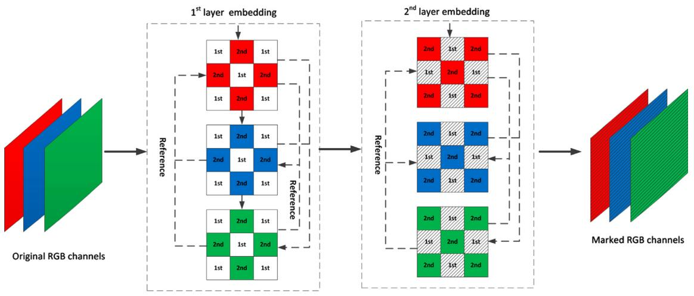
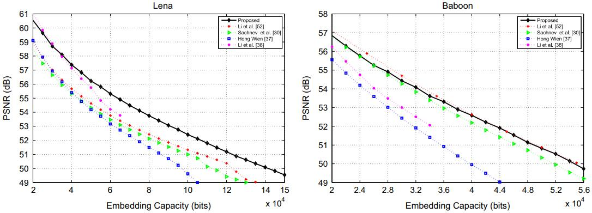
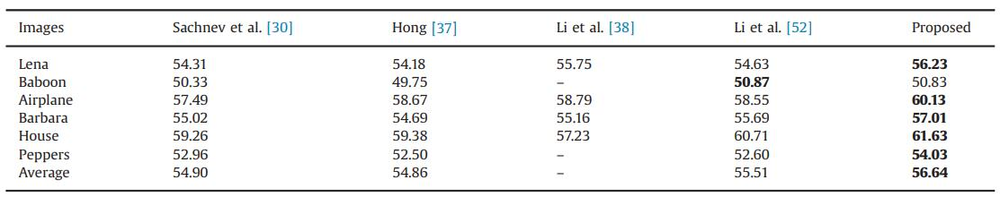

2015-Ou_SP_Color
=======


This repo is implementation for the accepted paper "[Efficient color image reversible data hiding based on channel-dependent payload partition and adaptive embedding](https://www.sciencedirect.com/science/article/pii/S0165168414004769)" (Signal Processing 2015).


<p align="center">     </p>
<p align="center"> Figure 1: Diagram of the double-layer embedding on RGB channels. </p>


## How to run

```
go to code
run main_M.m
```

## Experimental Results

<p align="center">     </p>
<p align="center"> Figure 2:  Performance comparison. </p>

<p align="center">     </p>
<p align="center"> Figure 3:  Performance comparison on six standard images, for a capacity of 50,000 bits.</p>


## Environment
Matlab 2016b <br>


## Acknowledgement
This work was supported in part by 973 Program (2011CB302204), National Natural Science Funds for Distinguished Young Scholar (61025013), National NSF of China (61332012, 61272355), PCSIRT (IRT 201206), Open Projects Program of National Laboratory of Pattern Recognition (201306309).

## Citation
If you find this work useful for your research, please cite
```
@article{OU2015642,
title = {Efficient color image reversible data hiding based on channel-dependent payload partition and adaptive embedding},
journal = {Signal Processing},
volume = {108},
pages = {642-657},
year = {2015},
issn = {0165-1684},
doi = {https://doi.org/10.1016/j.sigpro.2014.10.012},
author = {Bo Ou and Xiaolong Li and Yao Zhao and Rongrong Ni},
}
```

## License and Copyright
The project is open source under MIT license (see the ``` LICENSE ``` file).

